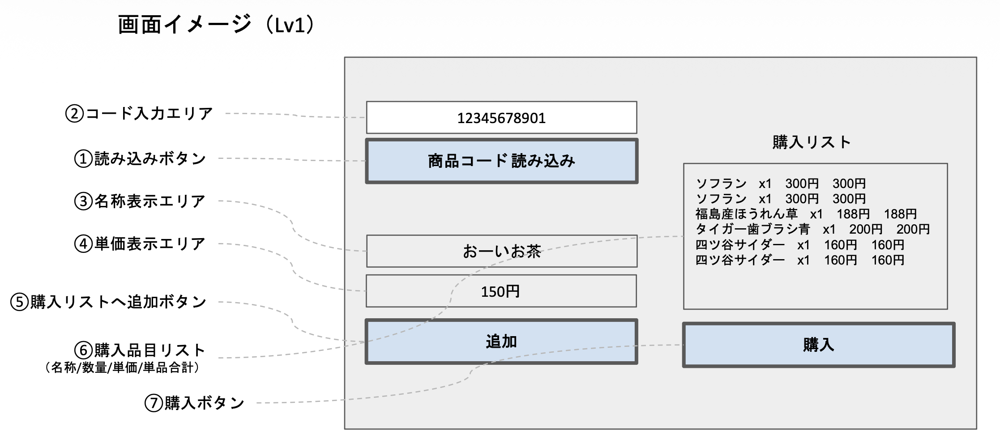

# Lv1 要求一覧（簡易POSアプリ）

このドキュメントには「何を作るべきか（要求）」だけを記載しています。
API仕様やDBテーブル設計などの「どう作るか（実装設計）」はあえて含めていません。
画面イメージや処理の流れから、必要なAPI・データ構造は自分で考えて設計してください。

---

## 1. 前提条件（変更不可）

- Webアプリとして動作すること（ブラウザからアクセス）
- フロントエンド：Next.js
- バックエンド：FastAPI
- インフラ：Microsoft Azure上で構築する（データベースはAzure Database for MySQL Flexible Serverを利用する。バックエンドをAzure上のどのサービスで動かすかは、後述の要求から自分たちで判断すること）

---

## 2. 機能要求

### 2.1 画面に必要な要素

- 商品コードを入力する場所
- 入力したコードで商品を検索する操作（読み込み）
- 検索した商品の「名称」を表示する場所
- 検索した商品の「単価」を表示する場所
- 検索結果を購入リストに追加する操作
- 追加された商品を一覧表示する購入リスト（名称・数量・単価・小計がわかること）
- 購入を確定する操作
- POSシステムにログインしているレジ担当者の情報
- お客様の会員IDの表示

### 2.2 商品検索の振る舞い

- 入力された商品コードに一致する商品が商品マスタに存在する場合、名称・単価を画面に表示する。
- 一致する商品が存在しない場合、「商品がマスタ未登録です」といった旨をユーザーに伝える。

### 2.3 購入リストへの追加の振る舞い

- 商品を購入リストに追加すると、コード入力・名称表示・単価表示の内容はクリアされる（次の商品を続けて登録できる状態に戻る）。
- 商品登録は何度でも繰り返せるが、x2個とせず、1商品1行の表示とする。

### 2.4 購入確定の振る舞い

- 購入リストの内容を確定すると、購入結果はデータベースに保存されなければならない。
- 保存する際、少なくとも「いつ・何を・いくつ・いくらで誰が買って誰がレジの処理をしたか」が後から分かる状態で残す必要がある。
- 購入確定後、税込みの合計金額をポップアップ等でユーザーに表示する。
- ユーザーがそのポップアップを閉じる操作をすると、画面上のコード入力・名称表示・単価表示・購入リストの内容がクリアされ、次の会員ID登録から再開できる状態に戻る。

### 2.5 レジ担当者のログイン

- レジ業務を開始する前に、担当者は「担当者ID」と「パスワード」を入力してログインする。
- ログイン専用の画面を用意し、正常にログインするとPOSアプリ画面に遷移する。
- 社外のID基盤（会社の統一ログインの仕組みなど）は利用せず、このシステム単独でID・パスワードを管理する。
- 誤った担当者IDまたはパスワードが入力された場合、ログインさせずエラーであることを伝える。
- ログインした担当者の情報は、その後の取引記録に紐づく想定である。

### 2.6 会員情報の取り扱い

- 買い物を始める前に、会員カードの番号（会員ID）をシステムに入力するステップがある。
- 会員には、会員ID・氏名・電話番号・住所・性別・年齢といった情報が登録済みの前提である。
- 入力された会員IDに対応する会員が存在しない場合の扱いも考慮する必要がある。
- 会員IDを手入力してから商品登録・購入へ進む、という順序がある。
- 会員IDを持っていないお客様は、入力不要で「お客様ID読み込みボタン」を押して商品登録・購入へ進む。

### 2.7 消費税の表示

- 購入確定時、税込み・税抜きの両方の合計金額をユーザーに提示すること。

### 2.8 消費税率の変更への備え

- 消費税率は将来変わる可能性がある。税率が変わった際、アプリのプログラムコードそのものを書き換えなくても対応できる状態にしておくこと（＝税率はどこかに“データとして”持たせ、変更可能にする）。

---

## 3. 非機能・その他の要求

- 検索や購入などの処理は、フロントエンド（Next.js）とバックエンド（FastAPI）で役割分担して実現すること（API連携が必要）。
- 購入データは失われてはならない（購入確定時にDBへの永続化が必須）。
- レジとしての利用中、営業時間内は常に同じような応答速度で動作すること。アクセスが久しぶりにあった瞬間だけ極端に遅くなる、といった挙動は避けたい。
- バックエンドは、DBとの接続を1リクエストごとに一から確立し直すのではなく、ある程度接続を維持した状態で運用することが望ましい（＝処理のたびに実行環境がゼロから立ち上がるような構成は避けたい）。

---

## 画面イメージ（Lv1）

- ①読み込みボタン
- ②コード入力エリア
- ③名称表示エリア
- ④単価表示エリア
- ⑤購入リストへ追加ボタン
- ⑥購入品目リスト（名称/数量/単価/単品合計）
- ⑦購入ボタン
