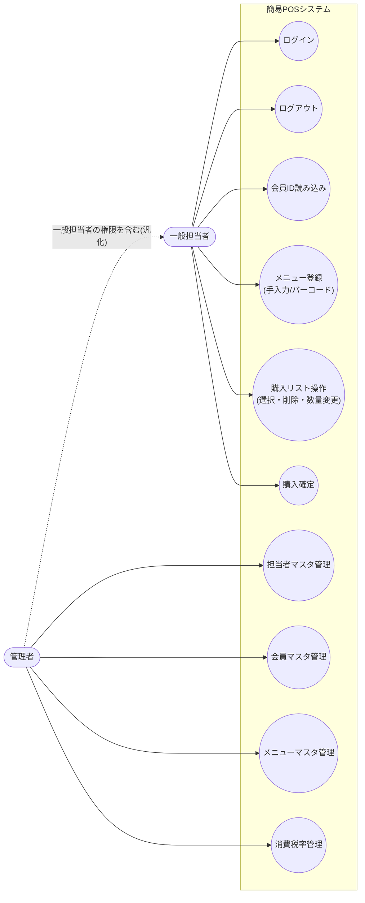
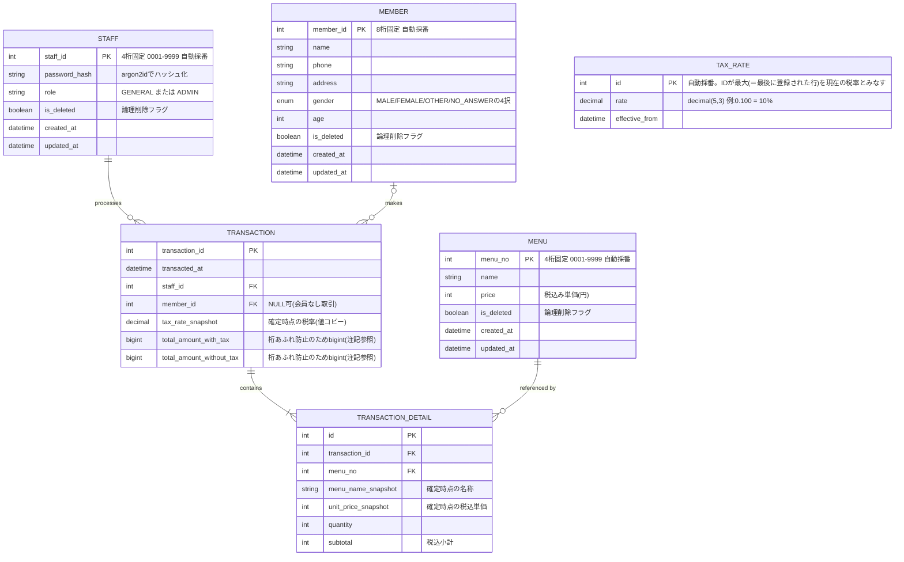
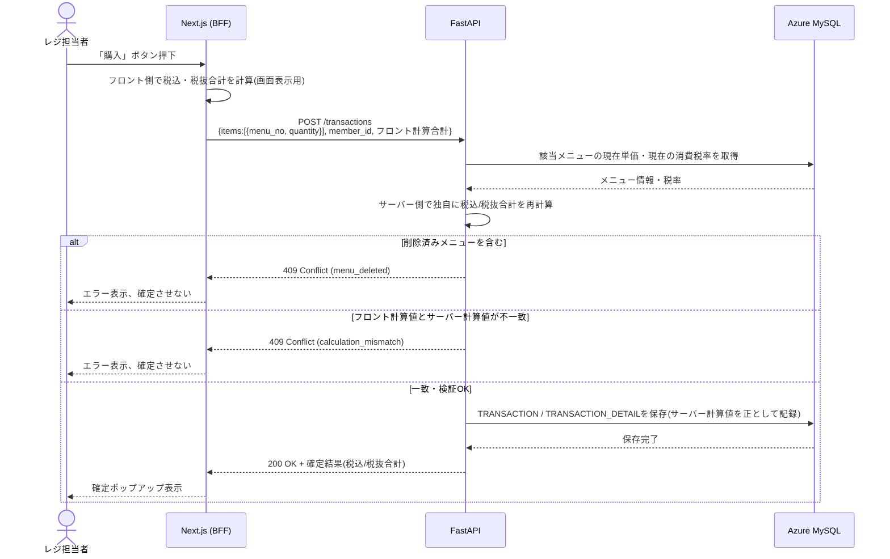

# 簡易POSアプリ 設計仕様書（v1.5）

対象範囲：`簡易POSアプリ_要件仕様書_ドラフト.md`（v1.4）で確定した要件を実現するための設計

> 本書は要件仕様書（v1.4）を前提とし、UML（ユースケース図・シーケンス図・ER図）を用いてシステム構成・データ構造を可視化した上で、講義で扱ったWebアプリのセキュリティ対策（認証認可・BFF・CORS・金額の二重計算照合・Swagger非公開・SQLインジェクション対策・OSS脆弱性対策）を設計に落とし込んだものです。
> 要件仕様書では「実装設計はスコープ外」としていた項目（入力値の上限・下限、エラー処理方針、API仕様など）を、本書で具体化します。
> 要件仕様書に明記のない値（トークン有効期限の分数など）は「設計決定」として本書で新たに定義し、その旨を明示します。

---

## 0. 前提技術スタック（要件仕様書 2章より）

| 項目 | 内容 |
|---|---|
| フロントエンド | Next.js（TypeScript） |
| バックエンド | FastAPI（Python） |
| データベース | Azure Database for MySQL Flexible Server |
| インフラ | Microsoft Azure |
| ORM | SQLAlchemy（バックエンド） |
| 認証方式 | JWT（Bearer トークン） |

---

## 1. システム構成図

ブラウザは Next.js（BFF）とのみ通信し、FastAPI バックエンドには直接アクセスしない構成とする（詳細は5.2節）。

```mermaid
flowchart LR
    subgraph Client["クライアント"]
        Browser["ブラウザ<br/>(レジ担当者)"]
    end

    subgraph Azure["Microsoft Azure"]
        subgraph FE["Next.js (Frontend + BFF)"]
            direction TB
            Pages["画面(SSR/CSR)"]
            BFFRoute["BFF: API Route<br/>(リバースプロキシ)"]
        end

        BE["FastAPI (Backend)<br/>認証認可・業務ロジック・計算検証"]
        DB[("Azure Database for MySQL<br/>Flexible Server")]
    end

    Browser <-->|HTTPS<br/>Cookie(HttpOnly, Secure)| FE
    BFFRoute <-->|内部HTTPS<br/>Authorization: Bearer JWT| BE
    BE <-->|SSL接続<br/>コネクションプール維持| DB
```

- ブラウザ⇔Next.js間：ブラウザJSに渡すのは画面表示に必要な情報のみ。JWT本体はHttpOnly Cookieに格納し、JavaScriptから読み取れないようにする（XSSによるトークン窃取対策）。
- Next.js⇔FastAPI間：サーバー間通信。FastAPIへは可能な限りAzure仮想ネットワーク内からのみアクセス可能とし、インターネットから直接到達できないようにする（App Service アクセス制限 / Private Endpoint等）。
- FastAPI⇔MySQL間：非機能要件（6章）にあるコールドスタート回避・接続維持の観点から、コネクションプーリング（例：SQLAlchemyの`QueuePool`）を用いる。

---

## 2. ユースケース図

Mermaidに正式なUMLユースケース図の記法はないため、フローチャートでアクター／ユースケース／システム境界を表現する。



- 「管理者」は「一般担当者」の全ユースケースに加えて、マスタメンテナンス系ユースケース（uc7〜uc10）を利用できる（要件仕様書 3.8節）。
- uc4（メニュー登録）は「メニュー番号手入力」「バーコードスキャン」の2手段を持つ（要件仕様書 3.3.1／3.3.2、include関係に相当）。

---

## 3. ER図（データベース設計）

要件仕様書 5章「データとして保持すべき情報」を具体的なテーブル設計に落とし込む。



### 設計上のポイント

| ポイント | 設計内容 | 対応する要件 |
|---|---|---|
| メニュー単価の履歴保持 | `MENU.price`は最新値のみ保持。取引明細には`unit_price_snapshot`として確定時点の単価を複製保存する | 要件3.6節／決定事項No.12 |
| 消費税率の履歴保持 | `TAX_RATE`は最新値の管理用。`TRANSACTION.tax_rate_snapshot`に確定時点の税率を値として複製保存する（FKではなく値コピー） | 要件3.6節／決定事項No.12 |
| マスタの削除方式 | メニューだけでなく**担当者・会員も含めた全マスタで論理削除（`is_deleted`フラグ）を採用する**。物理削除にすると、既存の取引が参照している`staff_id`・`member_id`・`menu_no`のFK整合性が壊れ、「誰がレジ処理をしたか」「誰が購入したか」を後から追えなくなるため（要件3.6節）。一覧表示・POSメイン画面での検索では`is_deleted=false`のレコードのみを対象とする |
| 会員なし取引 | `TRANSACTION.member_id`はNULL許容 | 要件3.2節 |
| パスワード保管 | 平文保存せず、ハッシュ化した文字列のみ`password_hash`に保存（アルゴリズムの選定理由は5.1節参照） | 決定事項No.5 |
| IDの不変性 | 担当者ID・会員ID・メニュー番号は自動採番後、変更不可とする。削除（論理削除）してもIDは再利用しない | 決定事項No.18 |
| 消費税率の「現在値」判定 | `TAX_RATE`テーブルは変更のたびに新しい行をINSERTする（UPDATEしない）。`id`が最大の行を「現在の税率」として扱うことで、変更履歴も同時に保持できる | 要件3.6節・3.7節／決定事項No.12 |
| 合計金額列の型 | `TRANSACTION.total_amount_with_tax`／`total_amount_without_tax`は`int`ではなく`bigint`とする。6章の上限値（単価999,999円×数量99個×行数50行）で理論上の最大値を試算すると約49.5億円となり、一般的な32bit `int`型の上限（約21.5億）を超えるため。取引明細1行あたりの`subtotal`・`unit_price_snapshot`は32bit `int`の範囲に収まるため`int`のままとする | 6章（入力値の上限一覧）との整合性確保のための設計決定 |
| 会員マスタの作成・更新日時 | `MEMBER`にも`STAFF`・`MENU`と同様に`created_at`／`updated_at`を持たせる（旧版では会員のみ欠落しており、マスタ間で監査項目に不整合があった） | 設計決定（監査項目の一貫性確保） |
| 性別の選択肢 | `MEMBER.gender`は自由記述の文字列ではなく、`MALE`（男性）／`FEMALE`（女性）／`OTHER`（その他）／`NO_ANSWER`（回答しない）の4値をとるenumとする。マスタメンテナンス画面ではプルダウン選択とし、自由入力は許可しない | 設計決定（旧版では選択肢未確定だった9章の論点を解消） |

---

## 4. シーケンス図

### 4.1 ログイン〜JWT検証フロー

```mermaid
sequenceDiagram
    actor U as レジ担当者(ブラウザ)
    participant FE as Next.js (BFF)
    participant BE as FastAPI
    participant DB as Azure MySQL

    U->>FE: 担当者ID・パスワードを送信
    FE->>BE: POST /auth/login (サーバー間通信)
    BE->>DB: staff_idで担当者を検索
    DB-->>BE: 担当者レコード(password_hash)
    BE->>BE: argon2idでパスワード照合
    alt 認証成功
        BE-->>FE: JWT発行 (sub=staff_id, role, exp=30分後)
        FE-->>U: Set-Cookie: session (HttpOnly; Secure; SameSite=Strict)
        Note over FE,U: JWT本体はJSに公開しない(XSS対策)
    else 認証失敗
        BE-->>FE: 401 Unauthorized
        FE-->>U: エラーメッセージ表示
    end

    U->>FE: POS画面での操作(APIリクエスト)
    FE->>BE: Cookieから取り出したJWTをAuthorizationヘッダに付与して転送
    alt トークン有効
        BE-->>FE: 200 OK + データ
        FE-->>U: 画面更新
    else トークン期限切れ/不正
        BE-->>FE: 401 Unauthorized
        FE-->>U: ログイン画面へ自動遷移(作成中の購入リストは破棄)
    end
```

要件仕様書3.1節「JWTトークンが期限切れになった場合、自動的にログイン画面に戻す」を、BFFが401応答を検知してクライアント側の状態をリセットし遷移させる形で実現する。

### 4.2 購入確定時の金額二重計算・照合フロー

フロントエンドの計算結果をそのまま信用せず、バックエンドが独自に再計算し突き合わせる（クライアント側での金額改ざん・表示バグの防止）。



- **必ずサーバー側の再計算値を保存する**（フロント値は表示上の参考値・検証用にのみ使う）。これにより、ブラウザの開発者ツール等でリクエストボディを改ざんされても、実際にDBへ保存される金額は改ざんの影響を受けない。

---

## 5. セキュリティ設計

### 5.1 認証・認可（ログイン／JWT）

| 項目 | 設計内容 |
|---|---|
| トークン形式 | JWT（**HS256**で署名する）。バックエンドはFastAPI単一サービスであり、署名検証を行う主体（BFF経由でFastAPI自身のみ）と署名を行う主体が同一のため、共通鍵方式のHS256で十分。RS256（公開鍵/秘密鍵方式）は署名者と検証者を分離できる利点があるが、その分の鍵管理コストに見合うメリットが現構成にはないため採用しない。署名鍵はソースコードに含めず、Azureの環境変数／Key Vaultで管理する |
| ペイロード（claims） | `sub`（担当者ID）, `role`（GENERAL/ADMIN）, `iat`, `exp` |
| 有効期限 | **30分**（設計決定。要件仕様書は「期限切れで自動ログアウト」とのみ規定） |
| リフレッシュトークン | 導入しない（設計決定）。要件上「期限切れ時は購入リストが失われてよい」とされているため、再ログインのみで運用しシンプルさを優先する |
| トークンの保存場所 | ブラウザの`localStorage`等JSからアクセス可能な場所には保存しない。BFFが発行するHttpOnly Cookieにのみ格納する |
| パスワードのハッシュ化 | **argon2id**を採用する。bcryptは72バイトを超える部分が切り捨てられる既知の制限があり、本設計のパスワード上限100文字（6章）と整合しないため、桁数制限のないargon2idを採用する。平文・可逆暗号化での保存は行わない |
| 認可（RBAC） | FastAPI側でJWTの`role`クレームを検証するDependency（例：`require_admin`）をマスタメンテナンス系エンドポイントに付与し、`role != ADMIN`の場合は403を返す |
| フロント側の導線制御 | `role`に応じてマスタメンテナンス画面へのリンクを非表示にする（UI制御のみに依存せず、必ずバックエンド側でも403判定を行う＝多層防御） |
| ログアウトの限界 | ログアウトはBFFがCookieを破棄することで実現し、発行済みJWT自体をサーバー側で強制失効させる仕組み（ブラックリスト等）は持たない。有効期限を30分と短く設定することで、漏洩時の悪用可能時間を限定しリスクを許容する設計とする |

### 5.2 BFF（リバースプロキシ）

- Next.jsをBFF（Backend for Frontend）として配置し、**ブラウザはFastAPIに直接アクセスしない**。
- BFFの役割：
  1. ブラウザからのリクエストをCookieのJWTで検証し、FastAPIへは`Authorization: Bearer <JWT>`ヘッダを付与して転送するリバースプロキシとして動作する。
  2. FastAPIの実アドレス（内部URL・ポート）をブラウザ・クライアントJSバンドルに一切露出させない（`NEXT_PUBLIC_`接頭辞の環境変数を使わず、サーバー側専用の環境変数として保持する）。
  3. Azure側でもFastAPIへのネットワークアクセスを、Next.jsが動く仮想ネットワーク／IPレンジからのみに制限する（App Serviceアクセス制限、Private Endpoint等）。これにより仮にBFFを迂回しようとしてもFastAPIへ到達できない。

### 5.3 CORS設定

- ブラウザは常にNext.js（BFF）と同一オリジンで通信するため、**ブラウザから見た限りではクロスオリジン通信は発生しない**設計とする。
- CORSはあくまで**ブラウザ自身が実装するJavaScriptからのクロスオリジンリクエスト制限**であり、curl等のツールやサーバー間通信（Next.js→FastAPI）そのものを防ぐ仕組みではない点に注意する（FastAPIへの直接到達自体は5.2節のネットワーク制限で防ぐ）。
- その上で、多層防御としてFastAPI側にも`CORSMiddleware`を設定し、万が一FastAPIが誤って外部公開された場合でも、ブラウザから想定外のオリジンでJavaScript経由の直接アクセスができないようにする。

| 設定項目 | 値 |
|---|---|
| `allow_origins` | BFF（Next.js）の本番オリジンのみを明示的に列挙（ワイルドカード`*`は使用しない） |
| `allow_methods` | 実際に使用するメソッドのみ（GET, POST, PUT, DELETE） |
| `allow_headers` | `Authorization`, `Content-Type` のみ |
| `allow_credentials` | 必要な場合のみ`True`（Cookieをブラウザ⇔FastAPI間で直接やり取りしないため、基本的に不要） |

### 5.4 金額計算の二重化（フロント⇔バックエンド照合）

- 4.2節のシーケンス図のとおり、購入確定時にフロントエンドが計算した合計金額と、バックエンドがDB上の現在の単価・税率から独自に再計算した合計金額を照合する。
- **不一致の場合は409エラーとし、確定させない**（削除済みメニュー混入時のエラーと同様の扱い、要件3.6節）。
- **保存されるのは常にサーバー側の再計算値**とし、フロント側から送られた金額をそのままDBに書き込むことはしない。
- **フロントエンド・バックエンドの両実装は、要件仕様書3.7節／決定事項No.24で定めた「メニュー行ごとに税抜き金額を計算し、端数を四捨五入してから合計する」という計算アルゴリズムに寸分違わず従うこと。** 丸め方式や計算順序がフロントとバックエンドで少しでも異なると、本来正しい金額であっても`CALCULATION_MISMATCH`が誤って発生してしまう。実装時は計算ロジックを共通化（例：計算式を仕様として明文化し、フロント・バックエンド双方のテストケースで計算結果が完全一致することを検証する）することを必須とする。

### 5.5 API仕様書（Swagger/OpenAPI）の非公開化

- FastAPIは`docs_url` / `redoc_url` / `openapi_url`を本番環境では`None`に設定し、`/docs`・`/redoc`・`/openapi.json`を非公開とする。

```python
import os

app = FastAPI(
    docs_url="/docs" if os.getenv("ENV") == "local" else None,
    redoc_url="/redoc" if os.getenv("ENV") == "local" else None,
    openapi_url="/openapi.json" if os.getenv("ENV") == "local" else None,
)
```

- ローカル開発環境（`ENV=local`）でのみ有効化し、開発・検証環境／本番環境では無効化することで、API内部構造の外部露出を防ぐ。

### 5.6 SQLインジェクション対策

| 層 | 対策 |
|---|---|
| フロントエンド（TypeScript） | API送受信するデータの型を`interface`/`type`として厳密に定義し、コンパイル時に不正な形の値を混入させない。フォーム入力値はzod等のスキーマバリデーションでAPI送信前にも型・パターン検証を行う |
| バックエンド（FastAPI） | 全リクエストボディをPydanticモデルで受け、型・桁数・正規表現（例：`staff_id: constr(pattern=r"^\d{4}$")`）による検証を行った上でのみビジネスロジックに渡す |
| データアクセス | SQL文字列の組み立て・連結を一切行わず、**SQLAlchemy（ORM）のクエリビルダ／バインドパラメータ**経由でのみDBアクセスする。生SQLを書く場合も必ずプレースホルダを使用し、値を直接文字列結合しない |

**フロント側の型定義例：**

```typescript
// 購入確定リクエストの型
interface TransactionCreateRequest {
  memberId: number | null;
  items: { menuNo: string; quantity: number }[]; // menuNo: 4桁固定文字列
  frontendCalculated: {
    totalWithTax: number;
    totalWithoutTax: number;
  };
}
```

### 5.7 フレームワーク・ライブラリ・OSSの脆弱性対策

- 依存パッケージは**バージョンを固定**し、ロックファイル（`package-lock.json` / `poetry.lock`または`requirements.txt`）をリポジトリで管理する。
- 導入前に主要ライブラリ（Next.js, FastAPI, SQLAlchemy, MySQLドライバ 等）の最新安定版・既知の脆弱性（CVE）有無を調査し、下表のような一覧に記録する。

| ライブラリ | 選定バージョン | 既知の脆弱性の有無（調査日時点） | 確認日 |
|---|---|---|---|
| Next.js | （実装時に確定） | （実装時に調査） | （実装時に記入） |
| FastAPI | （実装時に確定） | （実装時に調査） | （実装時に記入） |
| SQLAlchemy | （実装時に確定） | （実装時に調査） | （実装時に記入） |
| MySQLドライバ（例：`mysqlclient`/`PyMySQL`） | （実装時に確定） | （実装時に調査） | （実装時に記入） |

- 継続的な脆弱性検知のため、`npm audit` / `pip-audit`をCIに組み込み、GitHubのDependabot Alertsを有効化する。

### 5.8 初期管理者アカウントの投入

マスタメンテナンス画面は「管理者」権限を持つ担当者のみ利用可能（要件3.8節）だが、システム稼働開始時点では担当者が1人も存在せず、画面経由での最初の管理者登録はできない（鶏と卵の問題）。これを解消するため、以下の方式で初期投入を行う。

> **要件仕様書3.8節との関係について**：要件仕様書3.8節は「マスタの初期データはマスタメンテナンス画面を通じて登録する（DBへの直接投入は前提としない）」としているが、これは通常運用（2人目以降の担当者・会員・メニュー等の登録）を想定した規定であり、**「その画面を使うために必要な最初の管理者自身」をどう作るかは、要件仕様書10章「未確定事項」でも「管理者権限の初期登録方法」として名指しされていた、要件仕様書自身が意図的に保留していた論点である。** 本節はこの論点に対する回答として、最初の1人の管理者アカウントに限り例外的にDB直接投入を行う方式を決定したものであり、2人目以降の担当者・会員・メニュー・消費税率は要件仕様書3.8節の原則どおりマスタメンテナンス画面（8章のAPI経由）でのみ登録する。この例外は要件仕様書側にも決定事項として追記済み（要件仕様書 決定事項No.29）。

| 項目 | 設計内容 |
|---|---|
| 投入手段 | アプリケーションのAPIやマスタメンテナンス画面は使わず、**DBマイグレーション（またはデプロイ時に一度だけ実行するシードスクリプト）で直接INSERTする** |
| 投入するデータ | `staff_id = 0001`、`role = ADMIN`、`is_deleted = false`の担当者を1件登録する |
| パスワードの扱い | 平文パスワードをコードやマイグレーションファイルに直書きしない。デプロイ時に環境変数（例：`INITIAL_ADMIN_PASSWORD`、Azure側はApp Service応用設定／Key Vaultで注入）として渡した値を、デプロイスクリプト内でargon2idハッシュ化してからINSERTする |
| 初回ログイン後の運用 | 初期パスワードは初回ログイン後に管理者自身が`PUT /staff/0001`で変更することを運用上推奨する（要件上、複雑性要件・強制変更の仕組みは無いため、あくまで運用上の推奨に留める） |
| 冪等性 | マイグレーションは「`staff_id = 0001`が存在しない場合のみ投入する」条件を持たせ、再実行してもエラーにならず、かつ既存データを上書きしないようにする |

---

## 6. 入力値・数量の下限・上限一覧

要件仕様書に明記済みの制約は「要件」、本書で新たに定義した制約は「設計決定」として区別する。

| 項目 | 型・書式 | 下限 | 上限 | 根拠 |
|---|---|---|---|---|
| 担当者ID | 数字4桁固定 | 0001 | 9999 | 要件（決定事項No.13） |
| パスワード（入力） | 文字列 | 1文字 | 100文字 | 設計決定（複雑性要件なしは要件No.26。ただし極端に長い入力によるDoS的な負荷を避けるため上限のみ設定） |
| 会員ID | 数字8桁固定 | 00000001 | 99999999 | 要件（決定事項No.13） |
| 会員氏名 | 文字列 | 1文字 | 50文字 | 設計決定 |
| 電話番号 | 数字・ハイフン | 10文字 | 13文字 | 設計決定 |
| 住所 | 文字列 | 1文字 | 200文字 | 設計決定 |
| 性別 | enum（`MALE`/`FEMALE`/`OTHER`/`NO_ANSWER`） | - | - | 設計決定（4択固定、自由入力不可） |
| 年齢 | 整数 | 0 | 120 | 設計決定 |
| メニュー番号 | 数字4桁固定 | 0001 | 9999 | 要件（決定事項No.1） |
| メニュー名称 | 文字列 | 1文字 | 50文字 | 設計決定 |
| メニュー単価（税込） | 整数（円） | 1 | 999,999 | 設計決定 |
| 購入リストの数量（1メニューあたり） | 整数 | 1 | 99 | 要件（3.4.3節・決定事項No.16） |
| 購入リストの行数（メニュー種類数） | 整数 | 1 | 50 | 設計決定（要件に規定なし。1リクエストが際限なく肥大化しないための上限） |
| 消費税率 | 小数（decimal(5,3)、例:0.100） | 0.000 | 0.300 | 設計決定（初期値10%は要件・決定事項No.3） |
| JWTアクセストークン有効期限 | 分 | - | 30分 | 設計決定 |
| 一覧取得API(`/members`, `/menus`, `/staff`)の`limit` | 整数 | 1 | 100（省略時デフォルト20） | 設計決定（無制限取得によるDB負荷を防ぐため上限を設ける） |

---

## 7. エラー処理方針

### 7.1 エラーレスポンスの共通フォーマット

すべてのAPIエラーは以下の形式のJSONで返却する。

```json
{
  "error_code": "MENU_NOT_FOUND",
  "message": "指定されたメニュー番号は登録されていません。",
  "details": {}
}
```

### 7.2 HTTPステータスコードの割り当て方針

| ステータス | 用途 |
|---|---|
| 400 Bad Request | リクエスト形式は正しいが業務的に不正な値（例：数量0） |
| 401 Unauthorized | 未ログイン／JWT不正・期限切れ／担当者ID・パスワード誤り |
| 403 Forbidden | 認証済みだが権限不足（一般担当者がマスタメンテナンスAPIを呼んだ場合等） |
| 404 Not Found | 指定ID（会員・担当者・メニュー・取引）が存在しない |
| 409 Conflict | 業務ルール違反（削除済みメニュー混入、金額不一致、最後の管理者の削除・降格試行等） |
| 422 Unprocessable Entity | リクエストボディの型・形式エラー（Pydanticバリデーション） |
| 500 Internal Server Error | 想定外のサーバーエラー |

### 7.3 主なエラーコード一覧

| error_code | 状況 | HTTPステータス |
|---|---|---|
| `AUTH_INVALID_CREDENTIALS` | 担当者ID・パスワードが誤っている | 401 |
| `AUTH_TOKEN_EXPIRED` | JWTの有効期限切れ | 401 |
| `AUTH_FORBIDDEN` | 権限不足（管理者専用機能への一般担当者のアクセス） | 403 |
| `MEMBER_NOT_FOUND` | 入力された会員IDが存在しない、または論理削除済み | 404 |
| `MENU_NOT_FOUND` | 入力されたメニュー番号が存在しない | 404 |
| `STAFF_NOT_FOUND` | 指定した担当者IDが存在しない、または論理削除済み | 404 |
| `TRANSACTION_NOT_FOUND` | 指定した取引IDが存在しない | 404 |
| `MENU_DELETED_IN_CART` | 購入確定時、購入リストに削除済みメニューが含まれる | 409 |
| `CALCULATION_MISMATCH` | フロントとバックエンドの計算結果が一致しない | 409 |
| `LAST_ADMIN_PROTECTION` | 最後の管理者を削除・降格しようとした | 409 |
| `VALIDATION_ERROR` | 入力値が型・桁数・パターン要件を満たさない | 422 |
| `INTERNAL_ERROR` | 想定外のサーバーエラー | 500 |

---

## 8. API一覧

すべてブラウザ→Next.js（BFF）→FastAPIの経路で呼び出される。以下はFastAPI側のエンドポイント仕様（BFFは原則同一パス・同一形式で中継する）。

- **購入リストの選択・削除・数量変更（要件3.4節）にはAPIを設けない。** これらの操作は購入確定前のカート状態であり、フロントエンド（ブラウザのメモリ/state）内で完結させ、「購入」ボタン押下時に初めて`POST /transactions`としてサーバーに送信する設計とする。
- **バーコードで読み取った数字がメニュー番号（4桁）か会員ID（8桁）かの判別（要件3.3節）はフロントエンド側のロジックで行う。** 判別後、それぞれ`GET /menus/{menuNo}`・`GET /members/{memberId}`を呼び分ける。
- 一覧取得系API（`GET /members`, `GET /menus`, `GET /staff`）は、論理削除済み（`is_deleted=true`）のレコードを結果に含めない。
- 会員IDが未入力（要件3.2節「会員なし」の正常取引）の場合は`GET /members/{memberId}`自体を呼び出さない。呼び出すのは会員IDが入力された場合のみであり、その場合に対象の会員が存在しなければ`MEMBER_NOT_FOUND`（404）を返す。
- **数量上限（99個、決定事項No.16）のチェックは二重に行う。** ①カート構築中（スキャン／手入力での追加時）はAPIを呼ばないため、フロントエンドが即座にチェックしその場でユーザーに伝える。②`POST /transactions`側でも、改ざんされたリクエストに備えて`quantity`をPydanticの範囲制約（`ge=1, le=99`）で再検証する。②は単純な値範囲チェックのため、他の項目（氏名の文字数など）と同様に標準の`VALIDATION_ERROR`（422）として扱い、独立した業務エラーコードは設けない。

### 8.1 認証

| Method | Path | 概要 | 認証 | 入力 | 出力 |
|---|---|---|---|---|---|
| POST | `/auth/login` | ログイン | 不要 | `staffId: string(4)`, `password: string` | `token: string`, `role: "GENERAL"\|"ADMIN"` |
| POST | `/auth/logout` | ログアウト | 必須 | なし | `204 No Content` |
| GET | `/auth/me` | ログイン中の担当者情報取得 | 必須 | なし | `staffId: string`, `role: string` |

### 8.2 会員

| Method | Path | 概要 | 認証 | 権限 | 入力 | 出力 |
|---|---|---|---|---|---|---|
| GET | `/members/{memberId}` | 会員照会（読み込み） | 必須 | 一般以上 | `memberId: string(8)`（パス） | `memberId: string` |
| GET | `/members` | 会員一覧（マスタメンテ用） | 必須 | 管理者 | `offset?: int`, `limit?: int` | `members: Member[]` |
| POST | `/members` | 会員新規登録 | 必須 | 管理者 | `name: string`, `phone: string`, `address: string`, `gender: "MALE"\|"FEMALE"\|"OTHER"\|"NO_ANSWER"`, `age: int` | `memberId: string`（自動採番） |
| PUT | `/members/{memberId}` | 会員更新 | 必須 | 管理者 | `name`, `phone`, `address`, `gender`, `age`（型は上記と同じ） | `204 No Content` |
| DELETE | `/members/{memberId}` | 会員削除 | 必須 | 管理者 | なし | `204 No Content` |

### 8.3 メニュー

| Method | Path | 概要 | 認証 | 権限 | 入力 | 出力 |
|---|---|---|---|---|---|---|
| GET | `/menus/{menuNo}` | メニュー検索（手入力・スキャン共通） | 必須 | 一般以上 | `menuNo: string(4)`（パス） | `menuNo: string`, `name: string`, `price: int` |
| GET | `/menus` | メニュー一覧（マスタメンテ用） | 必須 | 管理者 | `offset?: int`, `limit?: int` | `menus: Menu[]` |
| POST | `/menus` | メニュー新規登録 | 必須 | 管理者 | `name: string`, `price: int` | `menuNo: string`（自動採番） |
| PUT | `/menus/{menuNo}` | メニュー更新 | 必須 | 管理者 | `name: string`, `price: int` | `204 No Content` |
| DELETE | `/menus/{menuNo}` | メニュー削除（論理削除） | 必須 | 管理者 | なし | `204 No Content` |

### 8.4 担当者

| Method | Path | 概要 | 認証 | 権限 | 入力 | 出力 |
|---|---|---|---|---|---|---|
| GET | `/staff` | 担当者一覧 | 必須 | 管理者 | `offset?: int`, `limit?: int` | `staff: Staff[]` |
| POST | `/staff` | 担当者新規登録 | 必須 | 管理者 | `password: string`, `role: "GENERAL"\|"ADMIN"` | `staffId: string`（自動採番） |
| PUT | `/staff/{staffId}` | 担当者更新（パスワード・権限変更） | 必須 | 管理者 | `password?: string`, `role?: string` | `204 No Content`（`LAST_ADMIN_PROTECTION`あり） |
| DELETE | `/staff/{staffId}` | 担当者削除 | 必須 | 管理者 | なし | `204 No Content`（`LAST_ADMIN_PROTECTION`あり） |

### 8.5 消費税率

| Method | Path | 概要 | 認証 | 権限 | 入力 | 出力 |
|---|---|---|---|---|---|---|
| GET | `/tax-rate` | 現在の消費税率取得（`id`最大の行を返す） | 必須 | 一般以上 | なし | `rate: number` |
| POST | `/tax-rate` | 消費税率変更（新しい税率を新規行として登録し、以降はその行が「現在値」となる） | 必須 | 管理者 | `rate: number` | `201 Created` |

> `TAX_RATE`はUPDATEせずINSERTのみで履歴を積み上げる設計（3章参照）のため、更新を意味する`PUT`ではなく新規作成を意味する`POST`とする。

### 8.6 取引（購入確定）

| Method | Path | 概要 | 認証 | 権限 | 入力 | 出力 |
|---|---|---|---|---|---|---|
| POST | `/transactions` | 購入確定（バックエンドで再計算・照合） | 必須 | 一般以上 | `memberId: string \| null`, `items: {menuNo: string, quantity: int}[]`, `frontendCalculated: {totalWithTax: int, totalWithoutTax: int}` | `transactionId: int`, `totalWithTax: int`, `totalWithoutTax: int` |
| GET | `/transactions/{transactionId}` | 取引参照（監査・確認用） | 必須 | 管理者 | なし | `Transaction` |

### 8.7 ヘルスチェック

Next.js（BFF）とFastAPIはAzure上で別々のサービスとしてホスティングされる想定のため、**双方に個別のヘルスチェックエンドポイントを用意する**（FastAPI側のみでは、BFF自体のコールドスタート・障害を検知できないため）。

| Method | Path | 提供元 | 概要 | 認証 | 入力 | 出力 |
|---|---|---|---|---|---|---|
| GET | `/health` | FastAPI | Azureのヘルスチェック／死活監視用 | 不要 | なし | `status: "ok"` |
| GET | `/api/health` | Next.js (BFF) | Azureのヘルスチェック／死活監視用（FastAPIへは中継しない） | 不要 | なし | `status: "ok"` |

非機能要件（6章）にある「コールドスタートを避ける」構成のため、Azure側のヘルスプローブ／Always On機能から両エンドポイントを定期的に呼び出す想定。いずれもDBアクセスは行わず、各プロセスの生存確認のみを行う。

---

## 9. 設計未確定事項

現時点で、本書として決めておくべき論点はすべて解決している（旧版で残っていた「初期管理者の投入方法」「会員の性別選択肢」「JWT署名アルゴリズムの最終選定」の3件は、それぞれ5.8節・3章（ER図）・5.1節で決定済み）。

今後、実装を進める中で新たな論点が出てきた場合は、都度この章に追加していく。

---

## 10. 変更履歴

| バージョン | 主な変更内容 |
|---|---|
| v1.0 | 初版作成。要件仕様書v1.3を基に、システム構成図・ユースケース図・ER図・シーケンス図（ログイン／購入確定）・セキュリティ設計（JWT認証認可・BFF・CORS・金額二重計算照合・Swagger非公開・SQLインジェクション対策・OSS脆弱性対策）・入力値の上下限一覧・エラー処理方針・API一覧を作成 |
| v1.1【レビュー1周目】 | ER図の不備を修正：`MENU`にのみ論理削除（`is_deleted`）を設けていたが、`STAFF`・`MEMBER`を物理削除すると過去取引のFK整合性が壊れる（誰が処理・購入したか追えなくなる）ため、両テーブルにも`is_deleted`を追加し、全マスタで論理削除方式に統一 |
| v1.2【レビュー2周目】 | パスワードハッシュ化方式を確定：bcryptは72バイト超の入力を切り捨てる制限があり、6章のパスワード上限（100文字）と矛盾するため、桁数制限のないargon2idに一本化（5.1節・ER図・シーケンス図4.1を修正） |
| v1.3【レビュー3周目】 | JWTベースの認証における既知の限界（ログアウトしてもサーバー側でトークンを強制失効できない）を5.1節に明記し、短い有効期限（30分）でリスクを許容する設計判断であることを明文化 |
| v1.4【レビュー4周目】 | 消費税率の「現在値」の判定方法が未定義だったため、`TAX_RATE`は変更のたびに新規行をINSERTし、最大IDの行を現在値とする方式に確定（ER図・設計上のポイント表を修正）。あわせて税率のデータ精度をdecimal(5,3)として明記（6章） |
| v1.5【レビュー5周目】 | 8章に、購入リストの選択・削除・数量変更（要件3.4節）に対応するAPIが存在しない理由（確定前はフロントエンドの状態のみで完結する設計であること）、およびバーコードの桁数判別がフロントエンド側ロジックであることを明記 |
| v1.6【レビュー6周目】 | エラーコード一覧（7.3節）の抜けを補完：担当者不在時の`STAFF_NOT_FOUND`、取引不在時の`TRANSACTION_NOT_FOUND`、500番台に対応する`INTERNAL_ERROR`を追加 |
| v1.7【レビュー7周目】 | 一覧取得系API（`/members`, `/menus`, `/staff`）が論理削除済みレコードを除外する旨、および担当者ID・会員ID・メニュー番号が採番後は変更不可・再利用しない旨を明記（8章・ER図設計上のポイント表） |
| v1.8【レビュー8周目】 | 非機能要件（コールドスタート回避）に対応するヘルスチェックエンドポイント`GET /health`を8.7節として新設 |
| v1.9【レビュー9周目】 | CORS節（5.3節）の説明が不正確だった点を修正：CORSはブラウザのJavaScriptからのクロスオリジン制御であり、サーバー間通信やcurl等を防ぐものではないことを明記し、誤解を招く表現を精緻化 |
| v1.10【レビュー10周目】 | 「設計未確定事項」章（9章）を新設し、初期管理者の投入方法・会員の性別選択肢・JWT署名アルゴリズムの最終選定など実装前に確認が必要な残課題を整理。全体を通して章番号の参照ミス（1章で「詳細は6.2節」としていたが正しくは5.2節）を修正し、章番号のずれ（旧9章「変更履歴」→10章）と用語・表記の統一を最終確認 |
| v1.11【レビュー11周目】 | `MEMBER`エンティティに`created_at`／`updated_at`が欠落し、`STAFF`・`MENU`と監査項目が不揃いだった不備を修正（ER図・設計上のポイント表に追加） |
| v1.12【レビュー12周目】 | 消費税率変更APIの不整合を修正：`TAX_RATE`はUPDATEせずINSERTのみで履歴を積む設計（v1.4）にもかかわらず、APIは更新を意味する`PUT /tax-rate`のままだったため、新規作成を意味する`POST /tax-rate`（201 Created）に変更（8.5節） |
| v1.13【レビュー13周目】 | DB設計上の桁あふれリスクを検出・修正：単価上限999,999円×数量上限99個×行数上限50行で理論上の合計金額最大値が約49.5億円となり、32bit `int`の上限（約21.5億）を超えるため、`TRANSACTION.total_amount_with_tax`／`total_amount_without_tax`を`bigint`に変更（ER図・設計上のポイント表） |
| v1.14【レビュー14周目】 | 一覧取得API（`/members`, `/menus`, `/staff`）の`limit`パラメータに上限・デフォルト値の定義がなかったため、上限100・デフォルト20を6章の入力値一覧に追加し、無制限取得によるDB負荷を防止 |
| v1.15【レビュー15周目】 | ヘルスチェック節（8.7）の不備を修正：FastAPI側の`/health`しか定義されておらず、Next.js（BFF）側のコールドスタート・障害を検知できなかったため、BFF用の`GET /api/health`を追加し、双方を個別に監視する設計に修正 |
| v1.16 | 9章に残っていた3件の設計未確定事項を解消。①初期管理者の投入方法：DBマイグレーション／シードスクリプトで`staff_id=0001`のADMINを投入し、パスワードは環境変数経由でargon2idハッシュ化して登録する方式に決定（5.8節を新設）。②`MEMBER.gender`の選択肢：`MALE`/`FEMALE`/`OTHER`/`NO_ANSWER`の4値enumに確定（ER図・6章・8.2節を修正）。③JWT署名アルゴリズム：単一バックエンド構成のためHS256に確定（5.1節） |
| v1.17【要件仕様書との突合レビュー】 | 要件仕様書（v1.3）との整合性を全項目で再確認し、2件の不整合を修正。①エラーコード`QUANTITY_LIMIT_EXCEEDED`(409)が、実際にはどのAPIからも返される経路がなく（数量上限チェックは購入確定前のカート構築時にフロントエンドで完結するため）、かつ`POST /transactions`側の防御的な再検証は単純な範囲チェックのため本来`VALIDATION_ERROR`(422)であるべきという矛盾を解消：同エラーコードを廃止し、二重チェックの仕組みを8章に明記（7.2節・7.3節・8章を修正）。②フロントエンドとバックエンドが独立に金額を計算する設計（4.2節・5.4節）において、両者が要件3.7節の丸めルール（行ごとに四捨五入）を寸分違わず実装しないと、正しい金額でも`CALCULATION_MISMATCH`が誤発生するリスクを5.4節に明記 |
| v1.18 | 要件仕様書3.8節「マスタの初期データはマスタメンテナンス画面経由（DB直接投入は前提としない）」と、5.8節の初期管理者DB直接投入方式との字面上の矛盾についてユーザーに確認し、「最初の1人の管理者に限りDB直接投入を例外的に認める」方針で合意。5.8節に要件仕様書3.8節との関係を説明する注記を追加するとともに、**要件仕様書側も3.8節・決定事項No.29・10章を更新（v1.3→v1.4）**し、両文書の内容を正式に一致させた |
